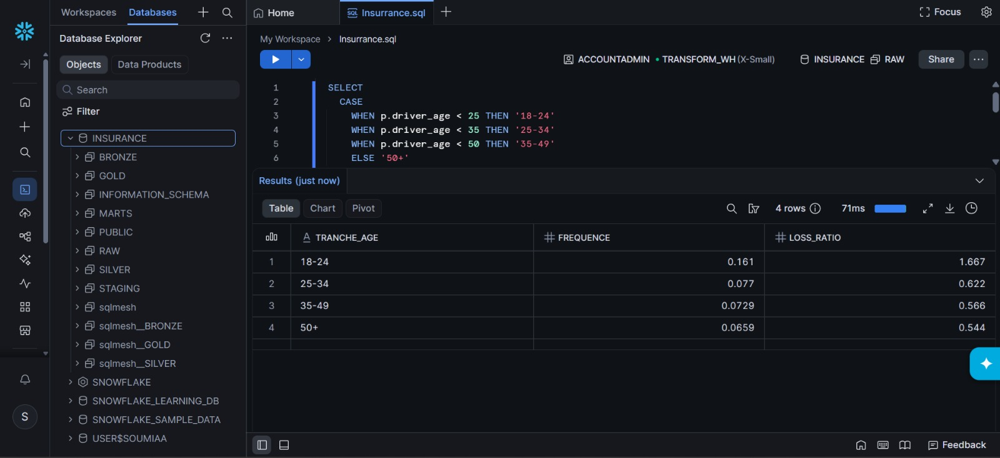
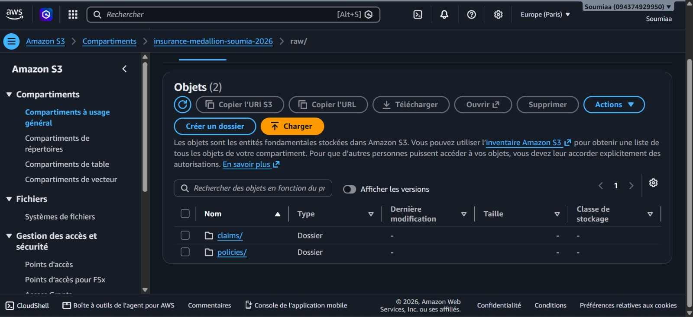
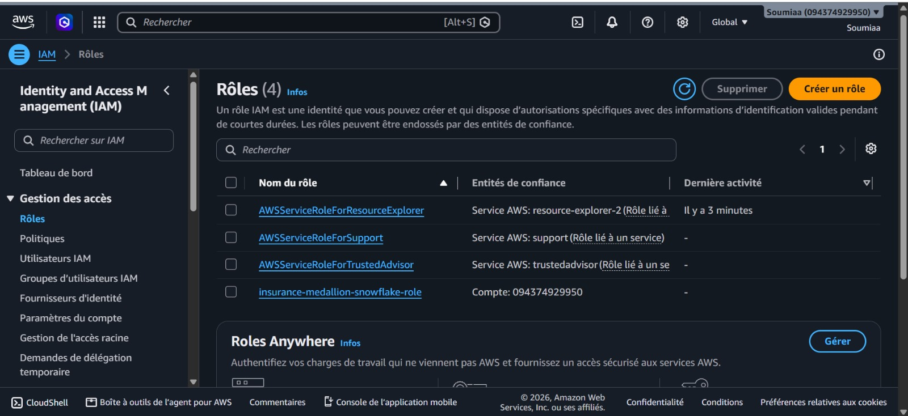
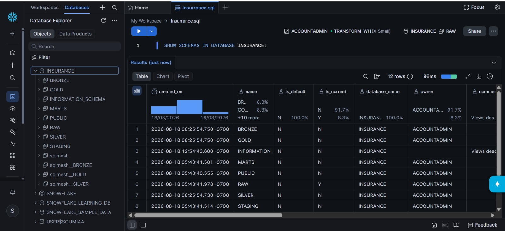
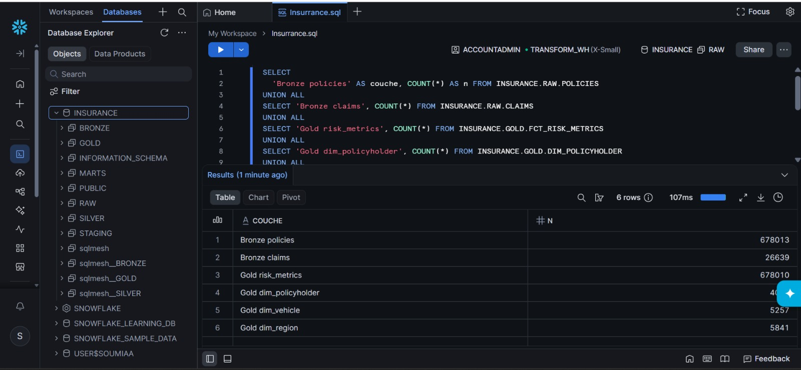
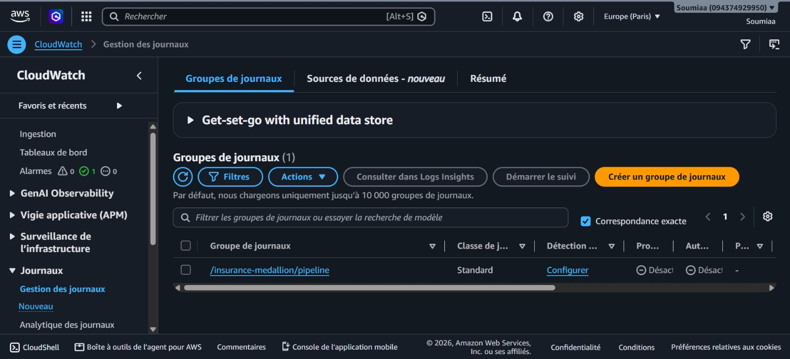
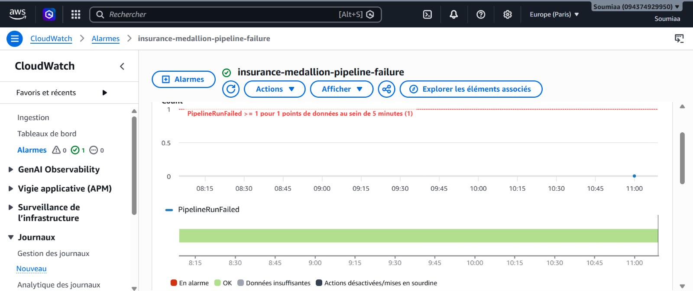

# Insurance Risk Analytics — Cloud Medallion Platform

> Plateforme data cloud-native de bout en bout pour l'analyse du risque et de la tarification en assurance automobile. Des données brutes jusqu'au dashboard décisionnel, entièrement provisionnée par Infrastructure as Code.

**Stack :** AWS (S3 · IAM · CloudWatch) · Terraform · Snowflake · SQLMesh · Great Expectations · Dagster · Streamlit · DuckDB

---

## Le problème métier

En assurance automobile, l'assureur encaisse des primes aujourd'hui contre la promesse de payer les sinistres futurs. Tout l'enjeu est de fixer le juste prix : trop bas, l'assureur perd de l'argent ; trop haut, les bons clients partent.

La question centrale à laquelle répond ce projet :

> **Quels profils d'assurés coûtent réellement cher, et sont-ils tarifés au bon prix ?**

La plateforme calcule les indicateurs au cœur du métier actuariel :

- **Fréquence** — nombre de sinistres par unité d'exposition
- **Sévérité** — coût moyen d'un sinistre
- **Loss ratio** — ratio sinistres / primes, qui détermine si un segment est rentable (< 1) ou déficitaire (> 1)

---

## Résultat clé

L'analyse révèle un déséquilibre net par tranche d'âge : les **jeunes conducteurs (18-24 ans) sont fortement déficitaires**, avec un loss ratio de **1,67** (ils coûtent 67 % de plus que ce qu'ils rapportent), tiré par une fréquence de sinistres environ deux fois supérieure aux autres tranches.

| Tranche d'âge | Fréquence | Loss Ratio |
|---------------|-----------|------------|
| 18-24         | 0,161     | **1,667** (déficitaire) |
| 25-34         | 0,077     | 0,622      |
| 35-49         | 0,073     | 0,566      |
| 50-64         | 0,066     | 0,544      |



---

## Architecture

Le projet suit une logique **développement local → production cloud**: on développe et teste vite en local (gratuit), puis on déploie sur le cloud.

```
DÉVELOPPEMENT LOCAL (gratuit, itératif)
  DuckDB + SQLMesh + Great Expectations + Dagster
  → construction et validation de tout le pipeline
        │  (déploiement)
        ▼
PRODUCTION CLOUD (provisionnée par Terraform)
  AWS S3 (landing zone)  →  Snowflake (data warehouse)  →  Streamlit (dashboard)
        │                        │
   IAM + CloudWatch        Architecture médaillon
   (accès + monitoring)    Bronze → Silver → Gold
```

### Le flux de données

1. **Ingestion** — extraction du jeu freMTPL2 (~680 000 contrats), sauvegarde en Parquet, upload vers S3
2. **Bronze** — chargement brut dans Snowflake via `COPY INTO` et storage integration sécurisée
3. **Silver** — nettoyage, typage, déduplication, validation qualité (SQLMesh + Great Expectations)
4. **Gold** — modélisation en étoile, calcul des indicateurs de risque (fréquence, sévérité, loss ratio)
5. **Restitution** — dashboard Streamlit connecté en direct à Snowflake

---

## Stack technique

| Catégorie | Outil | Rôle |
|-----------|-------|------|
| Cloud storage | **AWS S3** | Landing zone des données brutes (Parquet) |
| Sécurité | **AWS IAM** | Accès sécurisé Snowflake → S3 (moindre privilège) |
| Monitoring | **AWS CloudWatch** | Logs et alarme du pipeline |
| Infrastructure as Code | **Terraform** | Provisionnement reproductible de toute l'infra |
| Data Warehouse | **Snowflake** | Architecture médaillon en production |
| Transformation | **SQLMesh** | Modélisation en étoile, tests, lineage colonne |
| Qualité de données | **Great Expectations** | Validation des plages et contraintes métier |
| Orchestration | **Dagster** | Pipeline en assets observables (dev local) |
| Développement | **DuckDB** | Base locale pour itérer sans coût |
| Dashboard | **Streamlit + Plotly** | Restitution décisionnelle interactive |

---

## Le dashboard

Dashboard interactif à **3 vues**, connecté en direct à Snowflake, répondant aux questions métier :

- **Vue d'ensemble** — santé globale du portefeuille : KPI, loss ratio par région, structure démographique
- **Analyse du risque** — décomposition fréquence / sévérité, concentration du risque (âge × bonus-malus), carte fréquence vs sévérité
- **Rentabilité & tarification** — segments rentables vs déficitaires, priorisation volume × rentabilité, détail par segment

Une démo vidéo est disponible : [`dashboard/dashboard_demo.mp4`](dashboard/dashboard_demo.mp4)

---

## Infrastructure cloud (preuves de déploiement)

Toute l'infrastructure est provisionnée par Terraform en une commande.

**Données sur S3** — landing zone avec les contrats et sinistres partitionnés par date :



**Accès sécurisé par IAM** — un rôle dédié autorise Snowflake à lire le bucket S3, selon le principe du moindre privilège (lecture seule, sur ce bucket uniquement) :



**Architecture médaillon sur Snowflake** — schémas Bronze / Silver / Gold :



**Pipeline complet peuplé** — volumes cohérents à chaque couche :



**Monitoring CloudWatch** — le pipeline écrit ses logs dans un groupe de journaux dédié :



Et une alarme se déclenche automatiquement en cas d'échec :


```

## Structure du projet

```
insurance-medallion-platform/
├── ingestion/          # Extraction freMTPL2 → Parquet → S3
├── transform/          # Modèles SQLMesh (bronze / silver / gold)
├── quality/            # Suites de validation Great Expectations
├── orchestration/      # Assets Dagster + pipeline cloud observable
├── infrastructure/     # Terraform (S3, IAM, CloudWatch, Snowflake)
├── dashboard/          # Application Streamlit + démo vidéo
├── docs/               # Profiling, captures d'écran
├── .env.example        # Modèle des variables d'environnement
└── requirements.txt
```

---

## Lancer le projet

### Prérequis

- Python 3.11
- Terraform ≥ 1.7
- Un compte AWS et un compte Snowflake

### Installation

```bash
python -m venv venv
source venv/bin/activate        # Windows : .\venv\Scripts\Activate.ps1
pip install -r requirements.txt
```

### Configuration

Copier `.env.example` et renseigner les identifiants AWS et Snowflake (voir le fichier pour les variables attendues). Les secrets ne sont jamais commités.

### Déploiement de l'infrastructure

```bash
cd infrastructure
terraform init
terraform apply
```

### Ingestion et transformation

```bash
python ingestion/upload_to_s3.py      # données vers S3
cd transform
sqlmesh plan                           # construit Bronze / Silver / Gold sur Snowflake
```

### Dashboard

```bash
streamlit run dashboard/app.py
```

### Nettoyage

```bash
cd infrastructure
terraform destroy                      # supprime toutes les ressources cloud
```

---

## Compétences démontrées

- **Data Engineering** — IaC Terraform (AWS + Snowflake), ingestion Python, architecture médaillon, orchestration
- **Analytics Engineering** — SQLMesh (modélisation en étoile, tests, lineage), qualité Great Expectations
- **Cloud & DevOps** — S3, IAM (moindre privilège, storage integration), monitoring CloudWatch
- **Data Analysis** — dashboard décisionnel, indicateurs actuariels (loss ratio, fréquence, sévérité)

---

## Author

**Soumia El Haffari**

Data & Software Engineering Student
